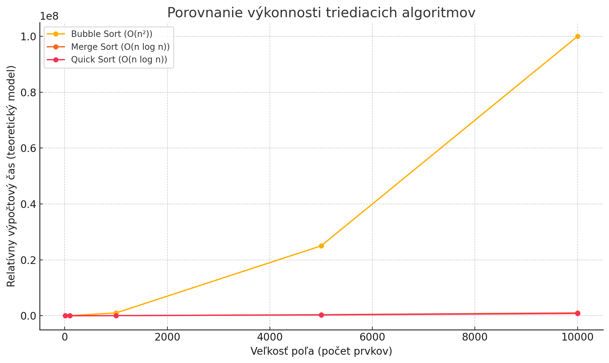







Porovnanie základných triediacich algoritmov **Bubble Sort**, **Merge Sort** a **Quick Sort**.

### **Základné porovnanie**

| Vlastnosť               | **Bubble Sort**                 | **Merge Sort**                 | **Quick Sort**                 |
|-------------------------|---------------------------------|--------------------------------|--------------------------------|
| Princíp                 | Opakované prehadzovanie susedov | Rozdelenie a zlučovanie        | Rozdelenie podľa pivota        |
| Zložitosť (najhoršia)   | O(n²)                           | O(n log n)                     | O(n²) (pri zlom výbere pivota) |
| Zložitosť (priemerná)   | O(n²)                           | O(n log n)                     | O(n log n)                     |
| Zložitosť (najlepšia)   | O(n) (už zoradené)              | O(n log n)                     | O(n log n)                     |
| Pamäťová zložitosť      | O(1)                            | O(n)                           | O(log n) (rekurzia)            |
| Stabilný algoritmus     | ✔️ Áno                          | ✔️ Áno                         | ❌ Nie (vo všeobecnosti)        |
| Triedenie „na mieste“   | ✔️ Áno                          | ❌ Nie (vyžaduje pomocné polia) | ✔️ Áno                         |
| Náročnosť implementácie | 🟢 Jednoduchá                   | 🟡 Stredne náročná             | 🔴 Náročnejšia                 |
| Vhodný pre veľké dáta   | ❌ Nie                           | ✔️ Áno                         | ✔️ Áno                         |

### **Kedy použiť ktorý algoritmus?**

- **Bubble Sort**
    - ✅ Vzdelávacie účely, veľmi malé dáta
    - ❌ Nevhodný pre reálne použitie – pomalý

- **Merge Sort**
    - ✅ Stabilné triedenie, veľké dáta
    - ✅ Vhodný pre spájanie externých súborov
    - ❌ Potrebuje dodatočnú pamäť (O(n))

- **Quick Sort**
    - ✅ Veľmi rýchly v praxi, triedi na mieste
    - ✅ Vhodný pre veľké dátové množiny v pamäti
    - ❌ Náchylný na zlé výbery pivota (možnosť O(n²))

### **Príklad triedenia poľa `[11, -2, 4, 52, -6, 17, 28]`**

| Algoritmus  | Výsledok                      | Počet krokov                    | Pamäť               |
|-------------|-------------------------------|---------------------------------|---------------------|
| Bubble Sort | `[-6, -2, 4, 11, 17, 28, 52]` | mnoho výmen (O(n²))             | 1                   |
| Merge Sort  | `[-6, -2, 4, 11, 17, 28, 52]` | logické rozdelenia + zlučovanie | pomocné polia       |
| Quick Sort  | `[-6, -2, 4, 11, 17, 28, 52]` | rýchle triedenie podľa pivota   | len zásobník volaní |

### **Zhrnutie**

- **Ak chceš jednoduchosť a názornosť → Bubble Sort**
- **Ak chceš stabilitu a efektivitu → Merge Sort**
- **Ak ti záleží na rýchlosti a nízkej pamäti → Quick Sort**

### Porovnanie výkonnosti grafom

Tento graf zobrazuje porovnanie výkonnosti troch algoritmov triedenia:

- **Bubble Sort**: výkon klesá veľmi rýchlo pri väčších vstupoch kvôli kvadratickej zložitosti O(n²).
- **Merge Sort**: rastie pomalšie – má zložitosť O(n log n), efektívnejší pre väčšie dáta.
- **Quick Sort**: veľmi podobný ako Merge Sort, ale o niečo rýchlejší v priemere (najmä pri dobre zvolenom pivote).

Graf jasne ukazuje, že pre väčšie dátové množstvá je **Bubble Sort nevhodný**, zatiaľ čo **Merge Sort a Quick Sort
škálujú podstatne lepšie**. Chceš aj časové porovnanie v milisekundách pri reálnych dátach?
